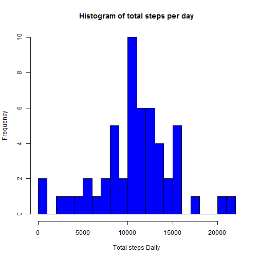
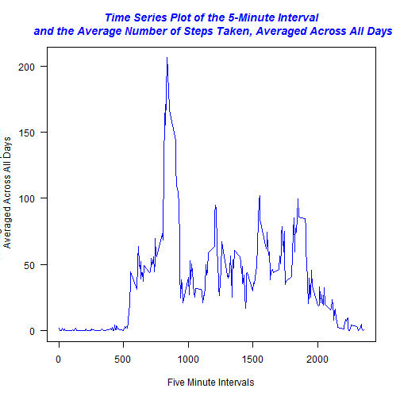
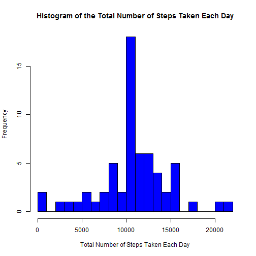
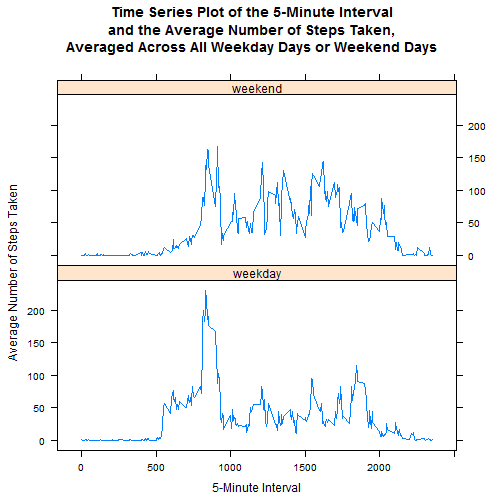

Assignment
==========
This assignment will be described in multiple parts. You will need to write a report that answers the questions detailed below. Ultimately, you will need to complete the entire assignment in a **single R markdown** document that can be processed by **knitr** and be transformed into an HTML file.

Throughout your report make sure you always include the code that you used to generate the output you present. When writing code chunks in the R markdown document, always use `echo = TRUE` so that someone else will be able to read the code. **This assignment will be evaluated via peer assessment so it is essential that your peer evaluators be able to review the code for your analysis.**

For the plotting aspects of this assignment, feel free to use any plotting system in R (i.e., base, lattice, ggplot2)

Fork/clone the GitHub repository created for this assignment. You will submit this assignment by pushing your completed files into your forked repository on GitHub. The assignment submission will consist of the URL to your GitHub repository and the SHA-1 commit ID for your repository state.

NOTE: The GitHub repository also contains the dataset for the assignment so you do not have to download the data separately.


##Loading and preprocessing the data

Show any code that is needed to

1. Load the data (i.e. **read.csv()**)
2. Process/transform the data (if necessary) into a format suitable for your analysis

Code for reading in the dataset and/or processing the data
If the file does not exist then download archive file 


```r
archiveFile <- "../repdata-data-activity.zip"
if(!file.exists(archiveFile)) {
  archiveURL <- "https://d396qusza40orc.cloudfront.net/repdata%2Fdata%2Factivity.zip"
  if(Sys.info()["sysname"] == "Windows") {
    download.file(url=archiveURL,destfile=archiveFile,method="curl")
  } else {
    download.file(url=url,destfile=archiveFile)
  }
}
if(!(file.exists("activity.txt"))) { unzip(archiveFile) }

## Read data files into data frames
#  Note: stringsAsFactors is set to FALSE so that dates are not factors but strings 
#  that will be converted to dates later
activity <- read.csv("activity.csv", stringsAsFactors = F)
```

### After we read in the data file, inspect contents of the data frame.

```r
names(activity)
```

```
## [1] "steps"    "date"     "interval"
```

```r
str(activity)
```

```
## 'data.frame':	17568 obs. of  3 variables:
##  $ steps   : int  NA NA NA NA NA NA NA NA NA NA ...
##  $ date    : chr  "2012-10-01" "2012-10-01" "2012-10-01" "2012-10-01" ...
##  $ interval: int  0 5 10 15 20 25 30 35 40 45 ...
```

```r
head(activity, 10)
```

```
##    steps       date interval
## 1     NA 2012-10-01        0
## 2     NA 2012-10-01        5
## 3     NA 2012-10-01       10
## 4     NA 2012-10-01       15
## 5     NA 2012-10-01       20
## 6     NA 2012-10-01       25
## 7     NA 2012-10-01       30
## 8     NA 2012-10-01       35
## 9     NA 2012-10-01       40
## 10    NA 2012-10-01       45
```


##What is mean total number of steps taken per day?

For this part of the assignment, you can ignore the missing values in the dataset.

Calculate the total number of steps taken per day

```r
## create a dataset with NA values removed. To consider only those days for which
#  step counts were recorded, use the complete.cases method
activity_complete_days <- activity[complete.cases(activity), ]

## Perform the analysis required for this part of the assignment using the group_by 
#  and summarize functions from dplyr. The sum can be calculated using summarise once
#  the data has been organized by date using group_by.

## Use group_by and summarize functions from dplyr
library("dplyr")

step_summary  <-  activity_complete_days %>% 
  group_by(date) %>% 
  summarize(daily_step_count = sum(steps))

## verify new data frame
head(step_summary, 5)
```

```
## Source: local data frame [5 x 2]
## 
##         date daily_step_count
##        (chr)            (int)
## 1 2012-10-02              126
## 2 2012-10-03            11352
## 3 2012-10-04            12116
## 4 2012-10-05            13294
## 5 2012-10-06            15420
```

```r
## Plot the graph
hist(step_summary$daily_step_count, 
     main = "Histogram of total steps per day",
     xlab = "Total steps Daily",
     col = "blue",
     breaks = 20
     )
```



Calculate and report the mean and median of the total number of steps taken per day

```r
## mean
mean(step_summary$daily_step_count)
```

```
## [1] 10766.19
```

```r
## median
median(step_summary$daily_step_count)
```

```
## [1] 10765
```


### What is the average daily activity pattern?

1\. Make a time series plot (i.e. **type = "l"**) of the 5-minute interval (x-axis) and the average number of steps taken, averaged across all days (y-axis)


```r
## Within each recorded interval across all days in each of the two months, what was the average 
#  number of steps taken in each interval? To answer this question, group_by each interval and 
#  then take the mean of the steps in each interval.
interval  <- activity_complete_days %>% 
  group_by(interval) %>% 
  summarize(mean_interval = mean(steps))


## Make a time series plot (i.e. type = "l") of the 5-minute interval (x-axis) and the average
#  number of steps taken, averaged across all days (y-axis)

## Plot the graph
plot(interval$interval, 
     interval$mean_interval, 
     type = "l", 
     las = 1, 
     col = "blue", 
     main = "Time Series Plot of the 5-Minute Interval\n and the Average Number of Steps Taken, Averaged Across All Days",
     col.main = "blue",
     font.main = 4,
     xlab = "Five Minute Intervals",
     ylab = "Average Number of Steps take\n Averaged Across All Days"
)
```



2\. Which 5-minute interval, on average across all the days in the dataset, contains the maximum number of steps?

```r
interval[which.max(interval$mean_interval), ]
```

```
## Source: local data frame [1 x 2]
## 
##   interval mean_interval
##      (int)         (dbl)
## 1      835      206.1698
```


### Imputing missing values

Note that there are a number of days/intervals where there are missing values (coded as **NA**). The presence of missing days may introduce bias into some calculations or summaries of the data.

1\. Calculate and report the total number of missing values in the dataset (i.e. the total number of rows with **NA**s)

```r
nrow(activity[is.na(activity$steps),])
```

```
## [1] 2304
```

2\. Devise a strategy for filling in all of the missing values in the dataset. The strategy does not need to be sophisticated. For example, you could use the mean/median for that day, or the mean for that 5-minute interval, etc.

`Solution: Use the mean for the 5-minute interval to populate NA values for a given interval.`


3\. Create a new dataset that is equal to the original dataset but with the missing data filled in.

```r
## merge original activity data frame with interval data frame
newactivity <- merge(activity, interval, by = 'interval', all.y = F)

## merge NA values with averages rounding up for integers
newactivity$steps[is.na(newactivity$steps)] <- as.integer(
  round(newactivity$mean_interval[is.na(newactivity$steps)]))

## drop and reorder columns to match original activity data frame
## http://stackoverflow.com/questions/4605206/drop-columns-r-data-frame
keeps <- names(activity)
newactivity <- newactivity[keeps]
```

4\. Make a histogram of the total number of steps taken each day and Calculate and report the **mean** and **median** total number of steps taken per day. Do these values differ from the estimates from the first part of the assignment? What is the impact of imputing missing data on the estimates of the total daily number of steps?

```r
## (total number of (steps taken per day))
newtotal <- aggregate(steps ~ date, newactivity, sum)

## add descriptive variable names
names(newtotal)[2] <- "sum_steps"

## check out new data frame
head(newtotal, 5)
```

```
##         date sum_steps
## 1 2012-10-01     10762
## 2 2012-10-02       126
## 3 2012-10-03     11352
## 4 2012-10-04     12116
## 5 2012-10-05     13294
```

```r
## Plot histogram of the total number of steps taken each day and Calculate and 
#  report the mean and median total number of steps taken per day.
hist(
  newtotal$sum_steps,
  col = "blue",
  main = "Histogram of the Total Number of Steps Taken Each Day",
  xlab = "Total Number of Steps Taken Each Day",
  breaks = 20
)
```



```r
## mean
mean(newtotal$sum_steps)
```

```
## [1] 10765.64
```

```r
## median
median(newtotal$sum_steps)
```

```
## [1] 10762
```


### Are there differences in activity patterns between weekdays and weekends?

For this part the weekdays() function may be of some help here. Use the dataset with the filled-in missing values for this part.

1\. Create a new factor variable in the dataset with two levels - "weekday" and "weekend" indicating whether a given date is a weekday or weekend day.

```r
## create new data frame
newnewactivity <- newactivity

## set up logical/test vector
weekend <- weekdays(as.Date(newnewactivity$date)) %in% c("Saturday", "Sunday")

## Fill in weekday column
newnewactivity$daytype <- "weekday"

## Replace "weekday" with "weekend" where day == Sat/Sun
newnewactivity$daytype[weekend == TRUE] <- "weekend"

## Convert new character column to factor
newnewactivity$daytype <- as.factor(newnewactivity$daytype)

## Confirm new data frame
str(newnewactivity)
```

```
## 'data.frame':	17568 obs. of  4 variables:
##  $ steps   : int  2 0 0 0 0 0 0 0 0 0 ...
##  $ date    : chr  "2012-10-01" "2012-11-23" "2012-10-28" "2012-11-06" ...
##  $ interval: int  0 0 0 0 0 0 0 0 0 0 ...
##  $ daytype : Factor w/ 2 levels "weekday","weekend": 1 1 2 1 2 1 2 1 1 2 ...
```

```r
head(newnewactivity, 5)
```

```
##   steps       date interval daytype
## 1     2 2012-10-01        0 weekday
## 2     0 2012-11-23        0 weekday
## 3     0 2012-10-28        0 weekend
## 4     0 2012-11-06        0 weekday
## 5     0 2012-11-24        0 weekend
```

```r
## double check
weekdays(as.Date(newnewactivity$date[3]))
```

```
## [1] "Sunday"
```

2\. Make a panel plot containing a time series plot (i.e. type = "l") of the 5-minute interval (x-axis) and the average number of steps taken, averaged across all weekday days or weekend days (y-axis). See the README file in the GitHub repository to see an example of what this plot should look like using simulated data.


```r
## the average number of steps taken, averaged across all days for each 5-minute interval
newinterval <- aggregate(steps ~ interval + daytype, newnewactivity, mean)

## add descriptive variable names
names(newinterval)[3] <- "mean_steps"
```

Inspect new data frame

```r
head(newinterval, 5)
```

```
##   interval daytype mean_steps
## 1        0 weekday 2.28888889
## 2        5 weekday 0.40000000
## 3       10 weekday 0.15555556
## 4       15 weekday 0.17777778
## 5       20 weekday 0.08888889
```

Plot results

```r
library(lattice)
xyplot(
  mean_steps ~ interval | daytype,
  newinterval,
  type = "l",
  layout = c(1,2),
  main = "Time Series Plot of the 5-Minute Interval\nand the Average Number of Steps Taken,\nAveraged Across All Weekday Days or Weekend Days",
  xlab = "5-Minute Interval",
  ylab = "Average Number of Steps Taken"
)
```


